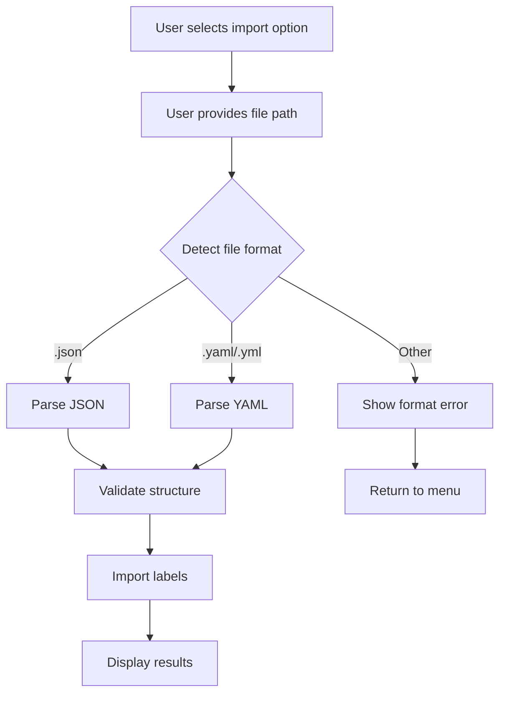

# Design Document

## Overview

This design extends Hyouji's import functionality to support YAML files alongside the existing JSON format. The implementation will leverage the `js-yaml` library (already available as a transitive dependency through ESLint) for YAML parsing and maintain the same validation, error handling, and user experience patterns as the current JSON import functionality.

The design follows the principle of minimal disruption to existing code while providing a seamless user experience that automatically detects file format based on file extensions.

## Architecture

### High-Level Flow



### File Format Detection Strategy

The system will use file extension-based detection:

- `.json` → JSON parser
- `.yaml` or `.yml` → YAML parser
- Other extensions → Error message with supported formats

### Code Organization

The implementation will extend the existing import functionality with minimal changes:

1. **Extend `importJson.ts`** → **`importLabels.ts`** (renamed for format neutrality)
2. **Add YAML parsing capability** alongside existing JSON parsing
3. **Maintain existing validation logic** for both formats
4. **Update file input prompts** to mention both supported formats

## Components and Interfaces

### Core Components

#### 1. Enhanced Import Function

```typescript
// Renamed from importLabelsFromJson to importLabelsFromFile
export const importLabelsFromFile = async (
  configs: ConfigType,
  filePath: string,
): Promise<void>
```

#### 2. Format Detection Utility

```typescript
type SupportedFormat = 'json' | 'yaml';

const detectFileFormat = (filePath: string): SupportedFormat | null => {
  const extension = path.extname(filePath).toLowerCase();
  switch (extension) {
    case '.json':
      return 'json';
    case '.yaml':
    case '.yml':
      return 'yaml';
    default:
      return null;
  }
};
```

#### 3. Format-Specific Parsers

```typescript
const parseJsonContent = (content: string): unknown => {
  return JSON.parse(content);
};

const parseYamlContent = (content: string): unknown => {
  return yaml.load(content);
};
```

### Data Flow

1. **File Reading**: Single `fs.readFileSync()` call for both formats
2. **Format Detection**: Based on file extension
3. **Content Parsing**: Format-specific parser (JSON.parse or yaml.load)
4. **Validation**: Shared validation logic for both formats
5. **Import Processing**: Existing label creation workflow

## Data Models

### Supported YAML Structure

The YAML format will support the same structure as JSON:

```yaml
# Example YAML format
- name: 'bug'
  color: 'd73a4a'
  description: "Something isn't working"
- name: 'enhancement'
  color: 'a2eeef'
  description: 'New feature or request'
- name: 'documentation'
  color: '0075ca'
  description: 'Improvements or additions to documentation'
```

### Validation Schema

Both formats will validate against the same `ImportLabelType` interface:

```typescript
type ImportLabelType = {
  name: string; // Required
  color?: string; // Optional
  description?: string; // Optional
};
```

## Error Handling

### YAML-Specific Error Cases

1. **YAML Syntax Errors**: Malformed YAML structure
   - Error message: "Invalid YAML syntax in file: {filePath}"
   - Include specific parsing error details

2. **YAML Loading Errors**: Issues with yaml.load()
   - Error message: "Error parsing YAML content: {error details}"

3. **Unsupported File Format**: Non-.json/.yaml/.yml extensions
   - Error message: "Unsupported file format. Supported formats: .json, .yaml, .yml"

### Error Handling Strategy

- **Graceful Degradation**: Continue processing valid labels even if some are invalid
- **Detailed Reporting**: Provide specific error messages for each validation failure
- **Progress Tracking**: Maintain progress indicators during import process
- **Summary Reporting**: Display final count of successful/failed imports

### Error Message Examples

```typescript
// Format detection error
"Error: Unsupported file format '.txt'. Supported formats: .json, .yaml, .yml";

// YAML parsing error
'Error: Invalid YAML syntax in file: labels.yaml';
'Parse error: YAMLException: bad indentation of a mapping entry at line 3, column 1';

// Structure validation error (same for both formats)
'Error: File must contain an array of label objects';
```

## Testing Strategy

### Unit Tests

1. **Format Detection Tests**
   - Test various file extensions (.json, .yaml, .yml, .txt, etc.)
   - Verify correct format identification

2. **YAML Parsing Tests**
   - Valid YAML structures
   - Invalid YAML syntax
   - Edge cases (empty files, malformed content)

3. **Validation Tests** (extend existing)
   - Same validation logic for both JSON and YAML
   - Error handling consistency

4. **Integration Tests**
   - End-to-end import workflow for YAML files
   - Error scenarios and recovery

### Test Data

Create test fixtures for:

- Valid YAML files with various label configurations
- Invalid YAML files (syntax errors, wrong structure)
- Mixed valid/invalid label entries
- Edge cases (empty arrays, missing fields)

### Compatibility Tests

- Ensure existing JSON import functionality remains unchanged
- Verify both formats produce identical results for equivalent data
- Test file format detection accuracy

## Implementation Dependencies

### Required Package

- **js-yaml**: Already available as transitive dependency through `@eslint/eslintrc`
- **@types/js-yaml**: Add as dev dependency for TypeScript support

### Package.json Changes

```json
{
  "devDependencies": {
    "@types/js-yaml": "^4.0.9"
  }
}
```

Note: `js-yaml` is already available through ESLint dependencies, so no additional runtime dependency needed.

## User Experience Considerations

### File Input Prompts

Update prompts to mention both supported formats:

- "Enter the path to your JSON or YAML file:"
- Error messages include both format options

### Progress Reporting

Maintain existing progress reporting format:

- `[1/5] Processing: bug`
- Same success/failure summary format

### Backward Compatibility

- Existing JSON import functionality remains unchanged
- No breaking changes to CLI interface
- Same menu option covers both formats

## Performance Considerations

### Memory Usage

- Single file read operation for both formats
- YAML parsing may use slightly more memory than JSON
- No significant impact expected for typical label files

### Processing Speed

- YAML parsing is marginally slower than JSON
- Negligible difference for typical use cases (< 100 labels)
- File I/O remains the primary bottleneck

## Security Considerations

### YAML Security

- Use `yaml.load()` instead of `yaml.loadAll()` to prevent multiple document processing
- YAML parsing is inherently safer than `eval()` but still requires input validation
- Maintain existing input validation for all parsed content

### File System Access

- Maintain existing file existence and permission checks
- No additional file system security concerns
