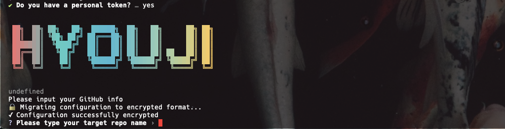

# Hyouji(表示) GitHub Label Manager


### article

https://levelup.gitconnected.com/create-github-labels-from-terminal-158d4868fab  
https://github.com/koji/Hyouji/blob/main/blog/article.md  

[](https://github.com/koji/github-label-manager/actions/workflows/ci.yml)
[](https://github.com/koji/github-label-manager/actions/workflows/publish.yml)
[](https://badge.fury.io/js/github-label-manager)

A simple CLI tool to create/delete labels with GitHub Labels API. Now available as a global npm package with persistent configuration storage.

### article

https://levelup.gitconnected.com/create-github-labels-from-terminal-158d4868fab



https://github.com/user-attachments/assets/739f185a-1bd0-411b-8947-dd4600c452c8

### Labels API

https://docs.github.com/en/rest/reference/issues#labels

`label data format`

```json
// label format
{
  "id": 3218144327,
  "node_id": "MDU6TGFiZWwzMjE4MTQ0MzI3",
  "url": "https://api.github.com/repos/koji/frontend-tools/labels/wontfix",
  "name": "wontfix",
  "color": "ffffff",
  "default": true,
  "description": "This will not be worked on"
}
```

## Installation

Install globally via npm:

```bash
npm install -g hyouji
```

Or use with npx (no installation required):

```bash
npx hyouji
```

## Features

This tool provides the following functionality:

1. Create a single label on a specific repo
2. Create multiple labels on a specific repo
3. Delete a single label from a specific repo
4. Delete all labels from a specific repo
5. Import labels from JSON or YAML file
6. **Display your saved settings** - View your stored GitHub configuration
7. **Persistent configuration** - Save your GitHub token and username for future use

## Usage

After installation, run the tool from anywhere:

```bash
hyouji
```

### First Time Setup

On your first run, you'll be prompted to enter:

- **GitHub Personal Token** - Generate one [here](https://github.com/settings/tokens) with `repo` scope
  
- **GitHub Username** - Your GitHub account name

These credentials will be securely saved and reused for future sessions.

### Menu Options

1. **Create a single label on a specific repo**
2. **Create multiple labels on a specific repo**
3. **Delete a single label from a specific repo**
4. **Delete all labels from a specific repo**
5. **Import labels from JSON or YAML file**
6. **Generate sample JSON** - Create a sample JSON file with predefined labels
7. **Generate sample YAML** - Create a sample YAML file with predefined labels
8. **Display your settings** - View your saved configuration
9. **Exit**

When you choose a create/delete/import action, you’ll be asked if you want to run in **dry-run mode**. Selecting “yes” shows what would happen without any API calls. Example:

```
=== Create preset labels summary ===
Mode: dry run (no API calls executed)
Created: 0  Failed: 0  Deleted: 0  Skipped: 24
```

Quick dry-run example (generate sample JSON then import it without touching GitHub):

```bash
hyouji            # choose “Generate sample JSON”
hyouji            # choose “Import labels from JSON or YAML” -> pick hyouji.json -> select dry-run = yes
```

### Settings Management

The tool now includes persistent configuration storage with enhanced security:

- **Automatic saving**: Your GitHub token and username are saved after first use
- **Settings display**: Use option 6 to view your current configuration
- **Secure storage**: Configuration is stored in `~/.config/github-label-manager/config.json`
- **Token encryption**: Your personal token is automatically encrypted using machine-specific keys
- **Automatic migration**: Existing plain text configurations are automatically upgraded to encrypted format
- **Token security**: Your personal token is never displayed in plain text, only an obfuscated preview is shown

### Dry-run Mode & Progress

- Select **yes** when prompted for dry-run to avoid any API calls; actions are listed as “Would create/delete…”.
- Each API call shows short status lines (e.g., “Creating label…”, “Deleted …”).
- A final summary reports created/deleted/skipped/failed counts and hints for next steps.

### Security Features

**Token Encryption**:

- All GitHub personal tokens are automatically encrypted before being saved to disk
- Encryption uses machine-specific keys derived from your system information
- Existing plain text configurations are automatically migrated to encrypted format on first run
- Even if someone gains access to your configuration file, the token remains protected

**Privacy Protection**:

- Tokens are never displayed in plain text in the interface
- Only an obfuscated preview (e.g., `ghp_****...****3456`) is shown in settings
- The settings display shows whether your token is encrypted or in plain text format

If you want to create/delete a single label, you need to type the followings.

#### create

- label name
- label color (technically optional)
- label description (technically optional)

#### delete

- label name

For multiple labels, use the import flow:

- Prepare a JSON or YAML file (examples live in `examples/labels.{json,yaml}`).
- Or generate fresh templates from the menu: **Generate sample JSON/YAML** will create `hyouji.json` or `hyouji.yaml` in your CWD.
- Run **Import labels** and provide the file path. You can choose **dry-run** first to see what would be created without hitting the API.

## Quick Start

1. Install the package globally:

   ```bash
   # npm
   npm install -g hyouji
   # pnpm
   pnpm install -g hyouji
   # yarn
   yarn global add hyouji
   # bun
   bun install -g hyouji
   ```

2. Run the tool:

   ```bash
   hyouji
   ```

3. On first run, enter your GitHub credentials when prompted

4. Select your desired operation from the menu

5. Follow the prompts to manage your repository labels

### Example Usage

```bash
# Run the tool
hyouji

# Or run without installing
npx hyouji
```

## Development

If you want to contribute or run from source:

```bash
git clone https://github.com/koji/hyouji.git
cd hyouji
npm install
npm run build
npm start
```

You can use `pnpm`, `yarn` or `bun`.

### File Import Support

The "Import labels from JSON or YAML file" option allows you to import multiple labels from external files. Both JSON and YAML formats are supported.

#### Supported File Formats

- **JSON files** (`.json` extension)
- **YAML files** (`.yaml` or `.yml` extension)

#### Label Structure

Both formats support the same label structure:

- `name` (required): The label name
- `color` (optional): Hex color code without the `#` symbol
- `description` (optional): Label description

#### JSON Example

```json
[
  {
    "name": "bug",
    "color": "d73a4a",
    "description": "Something isn't working"
  },
  {
    "name": "enhancement",
    "color": "a2eeef",
    "description": "New feature or request"
  },
  {
    "name": "documentation",
    "color": "0075ca",
    "description": "Improvements or additions to documentation"
  }
]
```

#### YAML Example

```yaml
# Sample YAML file for importing GitHub labels
- name: 'bug'
  color: 'd73a4a'
  description: "Something isn't working"

- name: 'enhancement'
  color: 'a2eeef'
  description: 'New feature or request'

- name: 'documentation'
  color: '0075ca'
  description: 'Improvements or additions to documentation'

# Labels with minimal configuration (name only)
- name: 'good first issue'
  color: '7057ff'
  description: 'Good for newcomers'

# Labels without description (optional field)
- name: 'wontfix'
  color: 'ffffff'

# Labels without color (will use GitHub default)
- name: 'question'
  description: 'Further information is requested'
```

#### Sample Files

You can find complete example files in the `examples/` directory:

- `examples/labels.json` - Basic label examples in JSON format
- `examples/labels.yaml` - Basic label examples in YAML format
- `examples/project-labels.json` - Project management labels in JSON format
- `examples/project-labels.yaml` - Project management labels in YAML format

#### Generate Sample Files

The tool can generate sample files for you:

- **Generate sample JSON** - Creates `hyouji.json` with predefined labels
- **Generate sample YAML** - Creates `hyouji.yaml` with predefined labels

Both generated files contain the same predefined labels and can be used as starting points for your own label configurations.

### Predefined Labels

The "Create multiple labels" option uses predefined labels from `src/constant.ts`. These include common labels for project management:

```js
{
  name: 'Type: Bug Fix',
  color: 'FF8A65',
  description: 'Fix features that are not working',
},
{
  name: 'Type: Enhancement',
  color: '64B5F7',
  description: 'Add new features',
},
// ... and many more
```

## Configuration

### Configuration File Location

Your settings are stored in:

- **Primary**: `~/.config/github-label-manager/config.json`
- **Fallback**: `~/.github-label-manager-config.json`

### Viewing Your Settings

Use the "Display your settings" menu option to:

- See your configuration file path
- View your stored GitHub username
- Check if a token is saved (without revealing the actual token)
- See when your configuration was last updated

### Clearing Configuration

If you need to reset your configuration, you can:

1. Delete the configuration file manually
2. The tool will prompt for new credentials on the next run

## Troubleshooting

### Invalid Token Error

If you see authentication errors:

1. Check that your token has the correct `repo` scope
2. Verify the token hasn't expired
3. The tool will automatically prompt for a new token if validation fails

### Permission Issues

If you encounter file permission errors:

- Ensure you have write access to your home directory
- The tool will attempt to use fallback locations if needed

## Requirements

- Node.js 20 or higher
- GitHub Personal Access Token with `repo` scope

https://user-images.githubusercontent.com/474225/130368605-b5c6410f-53f6-4ef0-b321-8950edeebf7d.mov

## Articles

- [Create GitHub Labels from Terminal](https://levelup.gitconnected.com/create-github-labels-from-terminal-158d4868fab)
- [Logical Colorful GitHub Labels](https://seantrane.com/posts/logical-colorful-github-labels-18230/)
